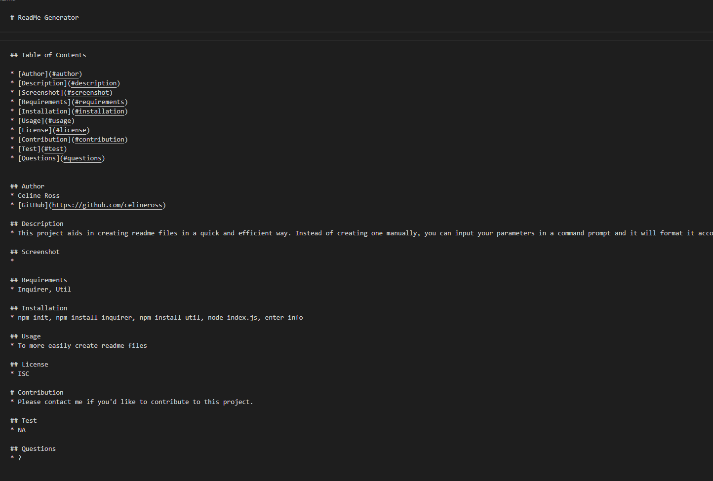

    # ReadMe Generator    

    ## Table of Contents

    * [Author](#author)
    * [Description](#description)
    * [Screenshot](#screenshot)
    * [Requirements](#requirements)
    * [Installation](#installation)
    * [Usage](#usage)
    * [License](#license)
    * [Contribution](#contribution)
    * [Test](#test)
    * [Questions](#questions)

    ## Author
    * Celine Ross
    * [GitHub](https://github.com/celineross)

    ## Description
    * This project aids in creating readme files in a quick and efficient way. Instead of creating one manually, you can input your parameters in a command prompt and it will format it accordingly.

    ## Screenshot
    * 

    ## Requirements
    * Inquirer, Util

    ## Installation
    * npm init, npm install inquirer, npm install util, node index.js, enter info

    ## Usage
    * To more easily create readme files

    ## License
    * ISC

    # Contribution
    * Please contact me if you'd like to contribute to this project.

    ## Test
    * NA

    ## Questions
    * ?
    